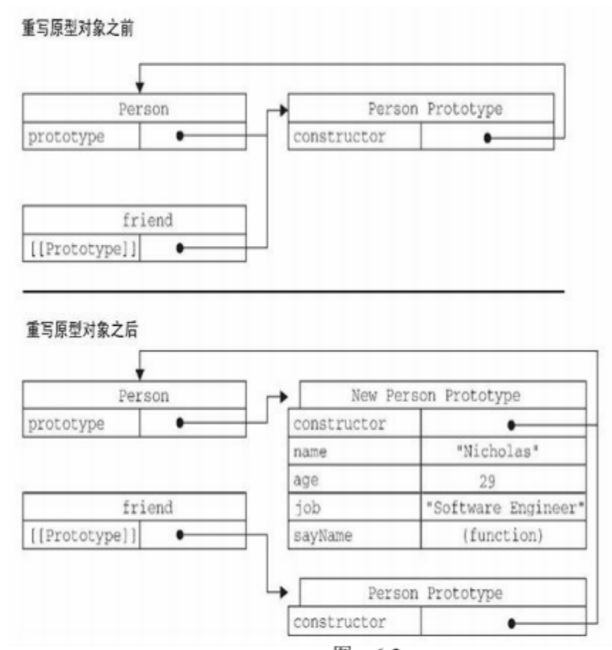

# 对象

[TOC]

## 理解对象

ECMA-262 把对象定义为：无序属性的集合，其属性可以包含基本值、对象或函数。

### 属性

`Object.defineProperty(obj, attr, configs) `;

定义多个属性方法：`Object.defineProperties()`;

读取给定属性的描述符：`Object.getOwnPropertyDescriptor()`;

#### 数据属性

具有四个描述特性，`configurable`, `enumeralbe`, `writable`, `value` 。普通方式定义属性时 xxable 默认值时true，使用 Object.defineProperty 定义属性时默认值是 false。同一个属性被定义成 configruable=false，后面就不能再改变configurable、enumerable、writable了。

#### 访问器属性

具有 `configurable`, `enumerable`, `get`, `set` 四种描述特性。

访问器属性不能直接定义，**需要确定一下ES6是否可以**。

## 创建对象

### 工厂模式

  用函数封装以特定接口创建对象的细节。解决了创建相似对象的问题，但不能解决对象识别的问题（怎么知道一个对象的类型）

  ```js
  function createPerson(name, age, job) {
  	var o = new Object();
  	o.name = name;
  	o.age = age;
  	o.job = job;
  	o. sayName = function(){}
  	return o;
  }
  
  var p1 = createPerson('zhangsan', 17, 'engineer')
  var p2 = createPerson('lisi', 18, 'engineer')
  ```

  

### 构造函数模式

  **像Object和Array这样的原生构造函数，在运行时会自动出现在执行环境中**。

  惯例构造函数大写字母开头。

  创建新实例必须使用 new 操作符。

  创建实例对象实际经历的四个步骤：

  1. 创建一个新对象
  2. 将构造函数的作用域赋给新对象（因此this就指向了这个新对象）
  3. 执行构造函数中的代码（新对象添加属性）
  4. 返回新对象

  注：如果构造函数 return 了非基本类型的值时，将会把return的对象作为创建的对象。

  构造函数模式的缺点：每个方法都要在每个实例上重新创建一遍。

  ```js
  function Person(name, age) {
    this.name = name;
    this.age = age;
    this.sayName = function() {}
  }
  
  var p1 = new Person('zhangsan', 17)
  var p2 = new Person('lis', 18)
  ```

  

### 原型模式

  为实例对象添加属性时，会屏蔽原型上的同名属性，而不是修改原型上属性，当用 delete 删除实例对象上的属性时，可以再次访问到原型上的同名属性

  - 原型与 in 操作符：

  1. 单独使用：通过对象能访问给定属性时(本身属性，原型上的属性) 返回 true。`prop in obj`  ； 

     `!obj.hasOwnProperty(name) && (name in obj)` 用来判断属性在原型上

  2. 在 for-in 循环中使用：返回所有对象能访问的、可枚举属性。其中包括存在于实例中的属性，也包括存在于原型中的属性。

  **注意**

  forin：实例对象和原型上的可枚举属性

  Object.keys()： 实例对象本身的可枚举属性

  getOwnPropertyNames() ：本身的所有属性，包括不可枚举属性

  ```js
  function Person(name, age) {
    this.name = name;
    this.age = age;
  }
  
  Person.prototype.sayName = function(){}
  
  var p1 = new Person('zhangsan', 17)
  var p2 = new Person('lis', 18)
  ```

  - 原型的动态性

    直接修改 prototype为一个新对象，而不是修改prototype的属性，之前创建的实例对象的`__proto__` 仍指向最初的原型，新创建的实例对象指向新的原型对象。

  

  - 原生对象的原型

    `String.prototype.substring()` `Array.prototype.sort()` ...

原型模式存在的问题：因为它省略了为构造函数传参初始化的环节，所有实例在默认情况下都将取得相同的属性值。原型模式最大的问题是共享引用类型值的属性。

### 组合使用构造函数模式和原型模式

这是最常见的方式。构造函数模式用于定义实例属性，原型模式用于自定义方法和共享属性。支持向构造函数传参。

```js
function Person(name, age) {
  this.name = name
  this.age = age
  this.friends = ['a', 'b']
}

Person.prototype = {
  constructor: Person,
  sayName: function() {}
}

var p1 = new Person('zhangsan', 18)
var p2 = new Person('lisi', 18)
```

### 动态原型模式

把所有信息封装在构造函数中，必要的情况下在构造函数中初始化原型。

```js
function Person(name, age) {
  this.name = name
  this.age = age
  
  if (typeof this.sayName != 'function') {
    Person.prototype.sayName = function(){}
  }
}
```

### 寄生构造函数模式

创建一个用来封装创建对象的代码的函数，返回新创建的对象。用途：比如创建一个具有额外方法的特殊数组。

```js
function Person(name, age) {
  var o = new Object()
  o.name = name
  o.age = age
  o.sayName = function(){}
  return o
}
```

### 稳妥构造函数模式

没有公共属性，而且其他方法也不引用this的对象


  

  

  

