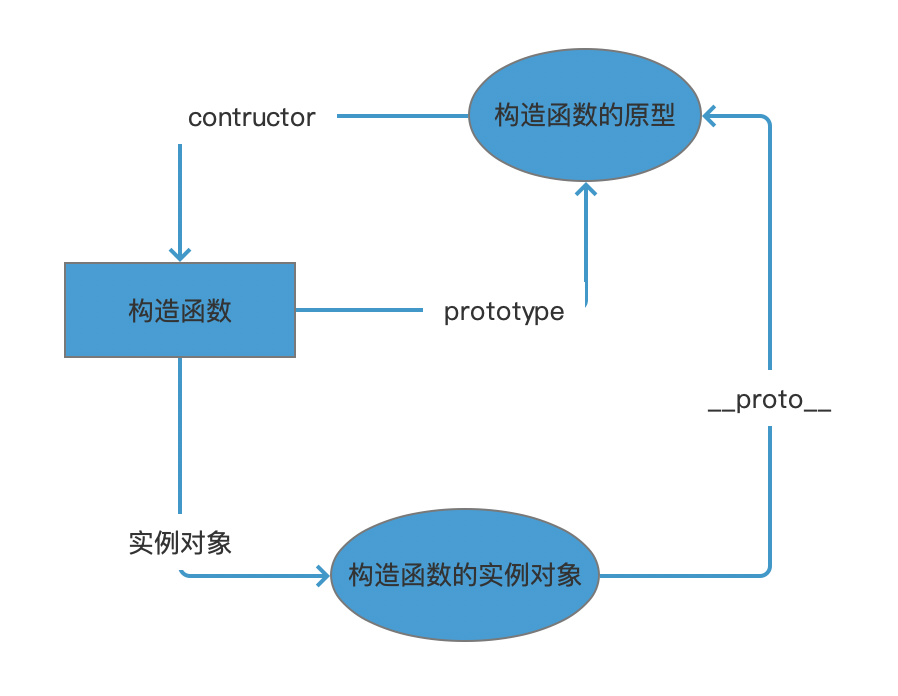

# 原型

## 函数对象与普通对象

通过 `new Function()` 创建的对象是函数对象，其余都是普通对象。

## 构造函数、实例对象和原型之间的关系

构造函数可以实例化一个实例对象；

构造函数中的 `prototype` 是构造函数的原型；

构造函数的原型对象（`prototype`)中的 `constructor` 构造器就是这个构造函数；

实例对象的原型对象 `__proto__` 指向的是构造函数的原型；

实例对象的 `constructor` 是构造函数。

## 原型对象

原型对象就是一个普通的（普通对象或函数对象）对象。

JavaScript 中的函数对象（函数也是对象）都会包含一些预定义的属性，其中 `prototype` 属性指向原型对象。

另外，每一个对象都会有一个 `__proto__` 属性（指向创建该对象的构造函数的原型对象，此即是原型链），但只有函数对象才有 `prototype` 属性。

## 参考

[最详尽的 JS 原型与原型链终极详解，没有「可能是」。（一）](https://www.jianshu.com/p/dee9f8b14771)

[最详尽的 JS 原型与原型链终极详解，没有「可能是」。（二）](https://www.jianshu.com/p/652991a67186)

[最详尽的 JS 原型与原型链终极详解，没有「可能是」。（三）](https://www.jianshu.com/p/a4e1e7b6f4f8)